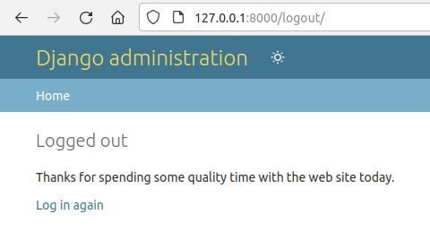

# Explorations
Through the process of writing out this repository, we had times where we wanted to sanity check thoughts or possibly test various ideas.

This is a high level summary of what we explored and what we learned

## 1. django-contrib-auth-forms
Folder: [explorations/1-django-contrib-auth-forms](../explorations/1-django-contrib-auth-forms)

As mentioned in [Web Framework Analysis](web-framework.md), I believed that Django had strong out of the box auth support. I'm learning that's technically true, with a big asterisk.

The drawback is the Django auth content is largely configured for internal only users by default. And fighting against that is kind of sticky/annoying.

> Django is still ahead of others with a User model standard and permissions to use out of the gate. e.g. Rails still offers [Devise][] but it's an implied rather than explicit standard. [Passport (JS)][] is entirely handwaving over how users get defined/set up.

[Devise]: https://www.digitalocean.com/community/tutorials/how-to-set-up-user-authentication-with-devise-in-a-rails-7-application#step-4-creating-the-user-model-with-devise
[Passport (JS)]: https://www.passportjs.org/howtos/password/

To elaborate further:

- User creation is only done through CLI or Django Admin, no forms/views/URLs to extend for your app
    - User creation methods: https://docs.djangoproject.com/en/4.2/topics/auth/default/#creating-users
    - Enumerated provided forms/views: https://docs.djangoproject.com/en/4.2/topics/auth/default/#using-the-views
- The only articles I found for user creation extend the form that's only used by Django Admin's "Add User" page
    - Article: https://simpleisbetterthancomplex.com/tutorial/2017/02/18/how-to-create-user-sign-up-view.html
    - Django Admin usage: https://github.com/django/django/blob/4.2.1/django/contrib/auth/admin.py#L74
- So that's only user creation (aka sign up), and probably the worst offender
- But dealing with the other ones feels like you're fighting the system rather than using a framework
    - There's limited/no documentation for the field names for the forms, which isn't good for custom styling
        - e.g. Login interfaces with [`username` and `password`](https://github.com/django/django/blob/4.2.1/django/contrib/auth/forms.py#L205-L210) but that's not in the docs
        - https://docs.djangoproject.com/en/4.2/topics/auth/default/#django.contrib.auth.views.LoginView
        - https://docs.djangoproject.com/en/4.2/topics/auth/default/#django.contrib.auth.forms.AuthenticationForm
    - On logout, you're navigated to a Django Admin page (until you set `LOGOUT_REDIRECT_URL` in `settings.py`)
    - and the "Log in again" URL navigates to Django Admin, not the /login route set up

My theory on why this is the set up, is [Django is quite upfront about its history](https://www.djangoproject.com/start/overview/):

> Django was invented to meet fast-moving newsroom deadlines, while satisfying the tough requirements of experienced web developers.

With a newsroom model, I'd wager the data model is oriented around internal users, not self-serve sign up (guessing this was pre-paywall days).

Maybe someone else has further clarity though.

I did get sign up and login working though, so that was nice.

There was also circuitous learning around Django forms themselves for me (majority of past work has been [Django REST Framework](https://www.django-rest-framework.org/)) but I still don't have full resolution on the good and bad (especially on a trivial app).

# 2. django-allauth
Folder: [explorations/2-django-allauth](../explorations/2-django-allauth)

This went **a lot** smoother than the `django.contrib.auth` counterpart. It wasn't an instant setup still, but it had reasonable docs, discoverable code, and never felt like I was fighting it (though it did confuse me/feel unintuitive sometimes).

The good:
- Lots of functionality which I can opt-in to using for the most part
    - e.g. Can do just sign up + login, then add email verification, then add more
- Intuitive and legible code

The bad:
- Opinions are just different from mine around UX for a web app at times
    - `"mandatory"` email confirmation page does not identify user until verification is completed (so can't tell user the email to go check)
        - This is prob easily updated through a `views.py` override
    - The confirm email page doesn't show `messages` from what I can tell
- `urls`, `views`, and `templates` naming not consistent, so a lot of reading to find what `template` you need to update

Notable:
- When using `email` as login identifier and allowing `first_name` auth, `username` defaults to `first_name`
    - I've realized that this is a feature, not a bug though. On social platforms, people identify in URLs through `username`, which is distinct from `email`
- `@verified_email_required` does not redirect people to a different page, instead the prompt is just served from the same page

Recommendations:
- Copy all templates into your folder to start
    - Why: Overrides are inevitable for content changes, both in terms of styling as well as text (copy)
- Enumerate all form fields upfront in your own `forms.py`
    - Why: The docs don't state this, so it's a bit of digging to get them. I've found digging is a context switch though
- Enumerate all template <> views or URL mappings upfront (same reason as forms)
- Enumerate all URLs and selectively disable to get startup running ASAP
    - i.e. Prob don't need change password or email at the start, but sign up + login + verify email seem good to have
- Set up `Site` and `SocialApp` configurations via migrations, to easily cover all environments
- `ACCOUNT_EMAIL_VERIFICATION = "mandatory"` requires updating 5 pages (i.e. confirmation prompt + reset password flow)
    - Consider using `"optional"` with convention around `@verified_email_required` instead

# 2.1. What to Explore Next
We've spent **a lot** of time learning with these past 2 explorations, and am nervous about spinning my wheels further on explorations that don't necessarily provide large insights.

Though technically, the last 2 were quite invaluable -- just it took a lot of polish in the end to feel like I understood them more/less.

And I'd be somewhat nervous to push a less experienced person in that direction since the path to success feels somewhat narrow =/ (e.g. must be comfortable reading library source code to know how to extend it).

Still, I think a large goal of this repo is to derisk what a good architecture can be, while I still have Django + React experience in my working context.

So let's enumerate:

- Using Django forms in a robust manner (e.g. onboarding flow, so it's close to CRUD but not quite)
    - Decision: Should explore
    - Why: Helps us understand approachability of Django forms for myself and implied future eng
- Django with sessions only, with full page render + routing handled by React
    - Using django-allauth for auth backends
    - Using API endpoints or DRF for everything else
    - Decision: Should not explore
    - Why: We've worked with a comparable setup so are not too concerned about unknowns
    - Pros:
        - Full expression through React
        - No context switching once in UI (e.g. HTML + CSS building vs CSS + JS building)
        - Declarative UI so no UI management (albeit widgets are simple)
        - Using same session as Django Admin, allowing tooling like "Login As"
    - Cons:
        - React is rebuilding UI for anything we were "batteries included" on (e.g. auth -- we did rewrite template but that's better than building request handling + routing)
        - Writing out API serializers + React queries + React query state handling for every data model
            - i.e. Every new model would require:
            - Django Model + Django View + **DRF Serializer + React Query (incl caching logic) + React Query State handling** + React UI
                - Bold is what I consider excess
            - vs
            - Django Model + Django View + Django Form + Django Template + Interactive UI
                - Technically Django Form is 1:1 to DRF Serializer here, but if we're just rendering content, then it wouldn't be done
- React hydration with Django
    - We anticipate this being kind of gnarly but are curious what it looks like
    - Decision: On the fence
    - Why: It could be really clean and simple, but we doubt it
    - Mini-exploration:
        - Yea, no -- this seems to be exclusively for SSR where content should be 1:1
        - https://react.dev/reference/react-dom/client/hydrateRoot#hydrating-server-rendered-html (https://archive.ph/lhmMm)
- Django somehow with React SSR
    - Mini-exploration:
        - This artcile captures an idea well, https://divyanshsingh2098.medium.com/server-side-rendering-with-react-node-js-and-django-944bafdf7e80 (https://archive.ph/WGHnH)
    - Unfortunately it sounds awful on paper
    - i.e. It has the same exact drawbacks as React doing full-page render
    - React would still need to make DB queries (either directly 🤮 or through Django), or Django needs to guess what React needs
    - Decision: No

Okay, so stepping back, I think this uncovers some pretty core truths:

- The development experience on batteries included pages is quite different from it on freely built ones
    - i.e. If I'm building an onboarding flow, I'm working from scratch and need to content with Django Forms and Django Templates
    - whereas with the batteries included ones, I did too -- but it wasn't writing it from scratch
- In our experience, Bootstrap and imperatively built widgets do work well for their purpose, but it's kind of an architecture exercise every time you built one
    - whereas with React, it was always sane due to its declarative nature
    - Scenario: If I want to build a map selection page with a dynamically updating acreage count and a confirmation modal that changes based on DB state,
    - then I'd be writing a lot of imperative logic in jQuery (a la Bootstrap) or an imperative JS system
    - whereas React is quite intuitive and sane due to its declarative nature
- The only big pain point with React would be managing DB query state
    - i.e. Loading + handling submission errors is fine, and prob even better in React due to having context for things like modals
- So maybe there's a solution here where:
    - Use a common CSS framework for both UIs
    - If the page is "batteries included", use Django's functionality as needed
    - Otherwise, load it as a React page - including 404s
    - Con: We still need to figure out how to avoid DB cache handling because models to interact given a large enough app size
- OR:
    - Keep the UI simple from an interactivity piece (difficult to predict)
    - and build in Django templates + widget oriented UI

- Reading some articles to see if cache handling is avoidable
- Could disable caching through `cacheTime: 0`, https://github.com/TanStack/query/issues/99 (https://archive.ph/vYAWH)
- I'm not sure they're making the point well, but it does seem like we could just use no key for queries and sidestep caching, https://christopherkade.com/posts/react-query (https://archive.ph/Uzglm)
- Interesting insight in some places using a `setState` to track queries, which is prob just React Query with no key and more work, https://alto.com/blog/post/react-query-for-managing-server-state (https://archive.ph/KzQ6p)

**Rambling goes off the rails here, losing sight of initial "rapid development" goals**

- So maybe that's an exercise worth exploring (though these things tend to break only when app is at large scale and you're developing against it regularly)

- That being said, I'm also recalling a large painpoint of building out lots of serializer nesting, just for serving an API response
- Whereas in theory a Django view and Django template would be accessing exactly what they need (and no concerns of leaking too much data)

- Ah, for serializers, after applying some thought:
- If it's a read only page like a dashboard, we can either just serialize without a serializer (duh)
- or build a separate file to track the serializers just for that piece with all its nesting

- Okay, so something to explore:
- Site setup with auth on Django + remaining content using React
    - Pages to include:
        - Auth (Django): Login + sign up + confirm email
        - Post-Auth (React): Dashboard of outer content (e.g. organizations) + CRUDL inside each (e.g. tasks (classic))
            - Dashboard should show task count, and thus invalidate on task modification
        - Find a common UI system to build against (prob Bootstrap or Tailwind due to experience with them)

- Generally curious exploration: Is there some way to use React where it uses HTML form submission?
    - Decision: No
    - Why: Not worth it, not a realistic scenario - since we lose error handling

- This is all kind of a time sink at a point, and we do have other obligations, so prob not going to work on this actively until later

- To reframe the dilemma:
- There are 2 ways to build a UI for an application:
- Either limit the designs upfront, and say "no" a lot more to functionality, but have a widget oriented implementation
- or
- Use a declarative system like React, but deal with all the consequences of that (e.g. large JS bundles, maintaining a serializers system + its headaches)
    - Serializers can either be page-centric or model-centric
    - Model-centric is way more reuseable
    - buuut... hmmmm... maybe there is something to reconsider with page-centric serializers?
        - SKIP: Page-centric or maybe action-centric serializers exploration? Sidesteps caching concerns entirely (not even a common thing really)
            - SKIP: This is prob along the spectrum of RPC vs REST, https://nordicapis.com/whats-the-difference-between-rpc-and-rest/
            - Looking at https://stackoverflow.com/a/55718066/1960509 - Realizing RPC would still have same headaches as REST with reuse across serializers -- prob exacerbated even due to keys being less clear =/
                - e.g. If an onboarding form + settings form use same model, then we're talking to that endpoint twice
                - buuut maybe this is find in practice and saner to develop against (e.g. handling one-offs)
                - I dunno, needs more time/thought

- What I don't recommend is something in-between:
- AJAX forms have little value add (e.g. there might be a loading spinner, but then need to handle error state -- ideal in-form since that's better UX)
- [Turbolinks](https://github.com/turbolinks/turbolinks) also offer little value (i.e. click a page/submit a form, and content swaps instead of

- React is unavoidable to either deal with hydration (and thus code split if Django is backend -- as well as querying Django anyway)
- or just make a lot of requests on page load
- I do not recommend trying to be clever and stating a bunch of data to be parsed at load time
- We can do this with some nice things like who is the user so content like nav might instantly render, but it's neat + extra content to maintain rather than critical

- Looking at React Query code we've worked with, there are def only a few key painpoints that are now obvious how to resolve:
    - For models, avoid nesting them in each other unless explicit opt-in from client, so client can then know what/how to track things
    - For CRUDL, use a utility to manage eager adds and what not
    - On **any** modification, invalidate dashboards
    - Set data with response from API (or invalidate it immediately)
    - Do not deal with JWT and tokens if you can, lean into sessions already handled from initial page load. These will also get free `Set-Cookie` header responses to always stay fresh

# 3. django-server-react-ui
After taking some time away from the content above, I'm curious to explore a variation where:

- Django serves minimal HTML, including auth, but keeps HTTP endpoints
    - This is because sometimes we want interactivity even on auth (e.g. suggesting email corrections)
    - and it'd be silly to need to rebuild the same widget/component twice in different parts of the system (e.g. a broader Django auth <> React non-auth pages split)
- Django handles sessions, and serves relevant content as part of HTML
- React handles loading states, interactivity, and oh-so-much more
- Django serves RESTful endpoints (easier than page-specific cache mangement)
    - As opposed to being specific GET/POST pairs for each page rendered (better for a React-less world, widgets only)
- Push the limits of React cache querying and serializers, remind self of how painful (or not painful) those can be to write

Once this is all done, it'd be interesting to build a contrasting app strictly with the GET/POST pairs mentioned

**Months pass**

- It's now October, we last wrote this in May
- The Django + React exploration got a lot more sticky than expected
    - e.g. Tricky to fill in React fields if doing HTML based submission
- We realized the ideal compromise is prob `django-allauth` with HTML forms pre-authentication, then React post-authentication
- We've updated and documented this in the README (both exploration and main)

# 4. django-allauth-react-split
I'm now coming back to this, because having a functional rapid Django <> React setup is becoming critical in a current project.

In the past, it was not rapid due to rolling our own solutions, and the rapid path I've explored so far is not 100% without risks.

There are a few pathways I see forward as a result, each with their own tradeoffs:

- React dev server content loaded as `<script />` on Django page
    - Error prone in its current form/exploration in `explorations/3-django-server-react-ui`, not worth pushing further
- Pre-auth `django-allauth` on HTML templates + post-auth React SPA with a proxy setup
    - Requires Django + React proxy to be seamless
        - We had something working with `create-react-app` in `explorations/3-django-server-react-ui`, but not 100% (e.g. LiveReload `.js` queries 404'd but worked)
        - It's possible to work through this with an NGINX container, but that limits our development environment
        - It's also possible to create a simple Node.js server to manage this, but at that point -- why not do the React dev server as the base proxy (which is what's concluded in the "Split app JWT" rambling)
    - Encourage CSS to be reused across scenarios
        - e.g. If we wind up using something like Tailwind, 1 more thing to worry about (e.g. purging CSS)
        - TODO: Address this in a successive exploration?
- Proxy setup with `django-allauth` as XHR backend only + React rendering all pages
    - Still requires Django + React proxy to be seamless
    - Possible issues on server + UI pages like reset password (prob would want to derisk first)
    - Still lots of busy work to just get this out the door + any future pages, so not considering it rapid
- 2 separate servers interacting over JWT and CORS, as we've done before but hate
    - Why we hate it: Entire app functionality can require 2 serial requests at every load depending on user configuration
        - i.e. (1) Retrieve user JWT + login + configuration -> (2) Set up UI based on user configuration -> (3) Make additional requests we didn't know we needed before
    - We also hate that there's no off the shelf library in Django for this
        - There's `django-simplejwt` but that's login + tokens only -- doesn't handle sign up, email verification, password reset, etc
    - Upon reflection of other auth provider setups, there might be a sane path forward with this:
        - i.e. They're typically on domains like <https://auth.example.com/>
        - and people rarely care about the visuals behind that (though would be nice if we get right)
        - Login happens normally + sanely with a `<Provider />` wrapper, https://auth0.com/docs/quickstart/spa/react/01-login#configure-the-auth0provider-component
        - After their login, they get sent back to a `/callback` URL (pushing hard for this, https://developer.auth0.com/resources/guides/spa/react/basic-authentication)
            - I kept getting confused how this works without leaking the query params in password reset
            - They use some galaxy brain logic by storing the access token in the hash, not the query params!
            - https://community.auth0.com/t/how-to-get-an-access-token-in-jwt-format/6185
    - How these providers work around serial requests problem:
        - Either they just don't bump into the issue
        - or maybe they're
    - I think this sadly might be the fastest path forward for a current project I'm staring at
        - but I like it because it leaves the door open for cookie based auth
        - and possibly works well with `django-loginas` since the auth originates from Django
    - Fwiw, we don't want to use these third party providers, since the lock-in cost is a big headache to get away from
        - i.e. Each user would need to transfer account

So, I'm going to break my own preferences somewhat and explore this 2 server + proxy setup, because it's the past of least resistance for current norms.

i.e. React as main server, proxying Django for auth + API with JWT handoff -- though now I'm also wondering if JWT is even needed if we're just doing this rearrangement...

But yea, I want -- React as main server, Django as `/auth` + `/api` routes with no shared CSS (pages are minimal as-is) (though I do understand not preferred, but that's something that can be addressed with time)

## Security detour
We were making good progress on the proxy setup (as well as considering alternative routes with), then had some scares/shocks around not considering security fully.

As a result, I'd like to talk through architectures and security issues that pop up.

### Same domain with proxy
The path we were exploring would expose the following surface to a user:

- https://app.example.com
    - / - Static webpage for React (hosted by NGINX/similar)
    - /main.abcdef.js, static JS bundle for React (hosted by NGINX/similar)
    - /auth - Proxied route (e.g. NGINX) to Django -> `django-allauth` for authentication (HTML forms using CSRF) (e.g. `/auth/login`, `/auth/signup`)
    - /api - Proxied route to Django -> Django REST Framework for JSON based handling

We have at least 2 ways to handle the session generated by authentication:

- Cookies
- JSON Web Tokens (JWT)

Cookies are tried and true for servers without any proxy magic. e.g. Techniques to guard them, like CSRF, and the surface area is relatively well known.

When a proxy is added to the mix... we'll get to that shortly.

JWT has some more headaches associated with it, and is much easier to implement incorrectly. That is:

- They should be stored via `HttpOnly` cookies, not `localStorage` or `sessionStorage` (since 3rd party scripts can get compromised + steal these resources)
- Refresh tokens are intended as long-lived but access tokens are short-lived + need regular regeneration, leading to app complexity
- JWT cannot be easily invalidated
- If any metadata is stored in the JWT, then it can also go out of date (since not invalidated)

I'd like to note that in **both these cases, they're vulnerable to CSRF unless we use SameSite**, and SameSite is tricky due to being a modern browser feature (admittedly [95% adoption][caniuse-SameSite]) being 95% supported.

The CSRF vulernability comes about even with APIs:

- An example CSRF attack with JSON can be crafted like this:
    - https://www.directdefense.com/csrf-in-the-age-of-json/
        - Here's an [example I made to verify](https://codepen.io/twolfson/pen/oNmNLxm)
        - The junk `foo` parameter would typically be discarded by an API, but not reject the entire request. This is because client <> server can often get out of sync/date and it'd compromise user experience
- APIs that are for full web applications will inevitably will need to accept non-JSON content (e.g. change profile photo, upload document)
    - In this scenario, we'd use a [`multipart/form-data`](https://developer.mozilla.org/en-US/docs/Learn/Forms/Sending_and_retrieving_form_data#the_enctype_attribute) `Content-Type` to avoid excess encoding/decoding work + file size compications
    - Unfortunately, that opens the door for a CSRF HTML form submitting the same =/

[caniuse-SameSite]: https://caniuse.com/same-site-cookie-attribute

With this background established, let's talk through what our plan is + how secure it is

#### Cookie baed auth
For simplicity, we can manage a `localStorage.loggedIn` to assume whether the cookie is still present or not. We won't know until we request the API due to `HttpOnly` setting + React page being static.

- User visits https://app.example.com/
    - React SPA loads and looks for `localStorage.loggedIn`
    - It doesn't see it so it redirect to https://app.example.com/auth/login
- Browser loads https://app.example.com/auth/login
    -
