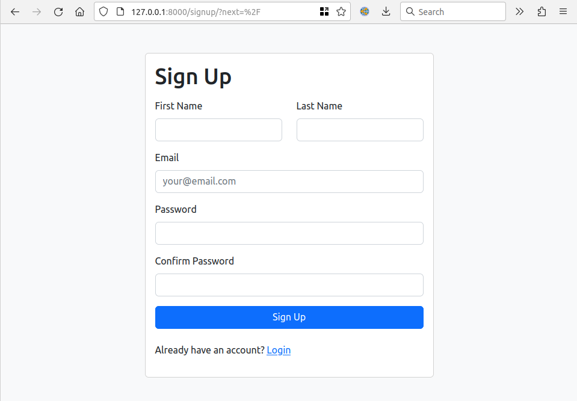
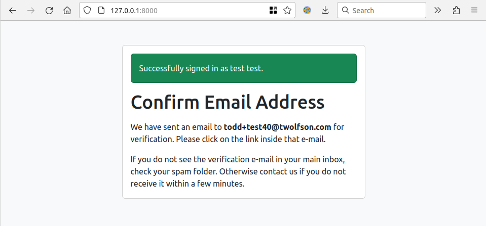
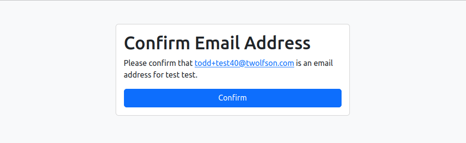
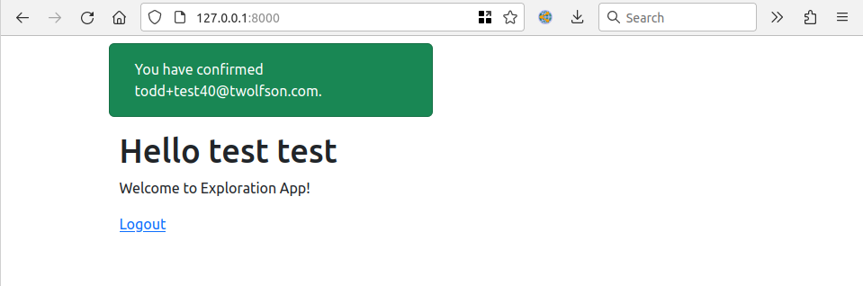
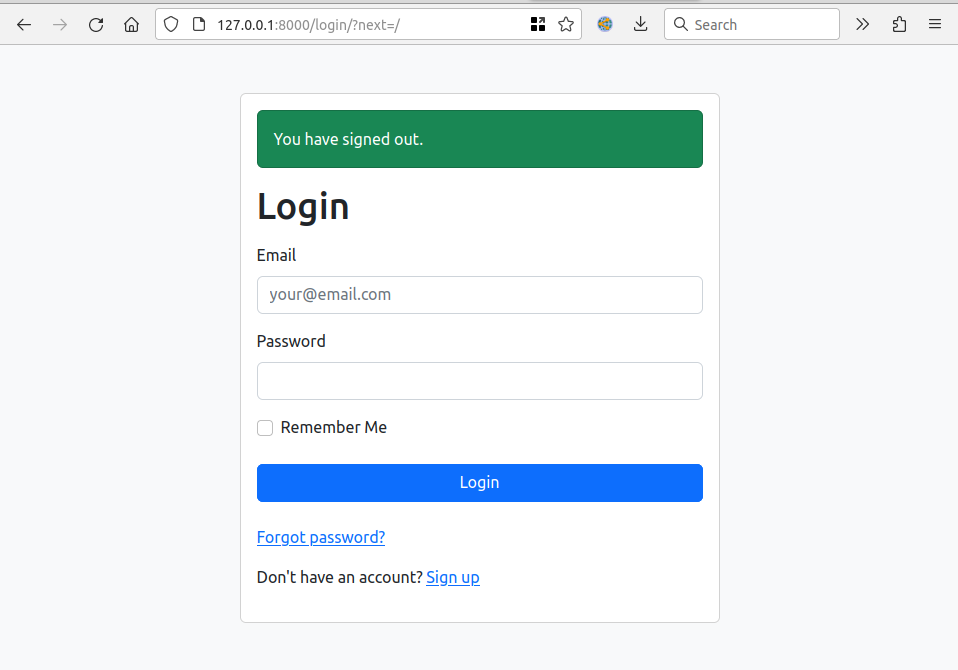

# Django Allauth exploration
This is an exploration for [if-i-were-to-build-a-startup-web-app](https://github.com/twolfson/if-i-were-to-build-a-startup-web-app)

After getting "far enough" with our [Django Contrib Auth Forms exploration](../1-django-contrib-auth-forms), we still wanted to find a good solution to capture Django's first class User strengths.

## Getting Started
To set up this repo, install the following dependencies:

- Python 3, https://wiki.python.org/moin/BeginnersGuide/Download
- Poetry, https://python-poetry.org/docs/#installation

then run the following:

```bash
# Open Poetry shell
poetry shell
# Should see "(2-django-allauth-py3.8)" now

# Install our dependencies
poetry install

# Run our migrations (we're using SQLite for simplest setup)
./manage.py migrate

# Run our server
./manage.py runserver
```

We can now see our server running locally at <http://127.0.0.1:8000/>

## Screenshots
Sign up:


Confirm email:


Confirm email (via email link):


Dashboard:


Logout:


## Development
### Linting
We've configured development with the following:

- `flake8`
- `black`

They should automatically be installed via Poetry and able to be used in your IDE or CLI

### LiveReload
We're using https://github.com/lepture/python-livereload for now. It's not required but it helps with page autorefresh on edit

## Testing
We provide a convenience wrapper for all our test utilities via:

```bash
./manage.py test
```

## Debugging
We install `django-extensions` to get access to `runserver_plus`. This has the following amazing features:

- Better tracebacks (Django's default screen feels lacking/less easy to follow)
- `--print-sql` support to catch `n+1` errors (not an issue in this exploration)
- Interactive debugging console in the middle of a request error, https://django-extensions.readthedocs.io/en/latest/runserver_plus.html
    - You'll be able to find the debugging PIN in your console

## Setup Log
- Copy from `1-django-contrib-auth-forms`
- Clean up `1-django-contrib-auth-forms` mentions + screenshots + setup log
    - `git grep -i "django-contrib"`
    - `git grep -i "django contrib"`
- `git grep -i "django.contrib"`
- `rm -r .venv` (to reset `poetry shell` naming)
- Removed `LOGIN_*` and `LOGOUT_*` from `settings.py` to explore defaults
- Following https://django-allauth.readthedocs.io/en/latest/overview.html guidance
- Installed great and nudged around `urls.py` to my comfort
    - Added back `LOGIN_URL`
- "Site" instruction wasn't required it seemed (didn't run, no errors) https://django-allauth.readthedocs.io/en/latest/installation.html#post-installation
    - "Add a Site for your domain, matching settings.SITE_ID (django.contrib.sites app)".
    - My concern with it would be ensuring all new clones get that set up (which is kind of non-trivial from a shell)
    - Note: The "Site" piece came up via "example.com" in the DB
- Docs seem lacking around customization but https://dev.to/gajesh/the-complete-django-allauth-guide-la3 mentioned in FAQ looks solid =D
- It was good for some info, but finding I just need to read between the lines a little on all pages
<br /><br />

- Seeing "ConnectionRefusedError: [Errno 111] Connection refused" for email sending (as expected)
    - Fix should be to log to console + surface message to user somehow (maybe flash message support now that we have it 🤩), https://django-allauth.readthedocs.io/en/latest/advanced.html#sending-email
<br /><br />

- Getting django-allauth setup rather quickly, a lot less fighting =D Though still relatively involved =/
- I do still feel this is equal to or better than other solutions I've seen. Very robust solution including email verification
<br /><br />

- Having trouble signing in after doing a password reset
- Time to use `./manage.py createsuperuser` and Django Admin finally ✨
- After logging in, I quickly see the email is unverified and easily verify it
    - Sadly no button to resend an email verification =/
<br /><br />

- DONE: Extend messages to the rest of the application
- DONE: Ensure the messages backend is session
<br /><br />

- Ahh, it wasn't verification issues =/
- I was auto-signed in as my superuser into the app, how confusing x_x
<br /><br />

- Using Firefox Container tabs to split out the different cookies =D :galaxy_brain:
    - TODO: Record a note about this in guidance
<br /><br />

- Hmm, we reset the password in Django Admin, and it's still broken?
<br /><br />

- Ohhh, the sign up utility was using the first name as the username -_-;;
- DONE: Fix sign up form to use email as username
- DONE: Add email == username enforcement/validation
- DONE: Add email verification requirement test
<br /><br />

- TODO: Oh, if we have Site(1) in the DB always via migration, then update it via migration ;D
    - Confirmed via fresh `./manage.py migrate` + `./manage.py dbshell`
<br /><br />

- TODO: Talk about `--keepdb` and `entr`
- Seeing response in tests in a whole new light =D
    - `context["form"].errors` seems so awesome =o
<br /><br />

- TODO: Talk about low-level hook for ENV=test
<br /><br />

- DONE: @email_verified decorator
<br /><br />

- TODO: Any lingering TODOs in code?
<br /><br />

- Continued to carrythrough styles from previous pages
- Stuck briefly on mandatory email verification meaning there is no identified user
<br /><br />

- TODO: Talk about 
<br /><br />

- TODO: Prob pause efforts on additional pages? Allauth seems to be friendly with incremental, so that's good
<br /><br />

- TODO: Talk through using same app for everything
https://stackoverflow.com/questions/64237/when-to-create-a-new-app-with-startapp-in-django
Nice reassurance from DoorDash philosophy
<br /><br />

- TODO: Pull more notes from exploration recommendations
<br /><br />

- `$ cp -r . ~/github/if-i-were-to-build-a-startup-web-app/explorations/2-django-allauth` + manual relocation
