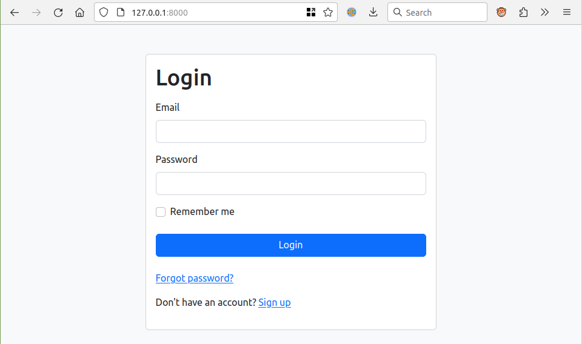
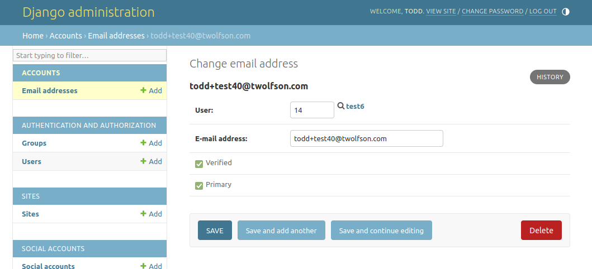

TODO: See TODOs

TODO: It seems that login was actually working in the last version, just we didn't have validation errors showing so we missed it in our testing. So let's restore it + add some *basic* validation

TODO: Add React to test suite

TODO: One plus is not needing to run LiveReload as its own process, but that's a small piece I guess =/

TODO: Remove unused code like we removed before, incl tests

TODO: Almost there with getting React to a sane state, let's use `json_script` to dump out errors, then 1:1 paste into an error field in React, so we can sanely see when a login fails/not during a test run

# Django Server / React UI exploration
This is an exploration for [if-i-were-to-build-a-startup-web-app](https://github.com/twolfson/if-i-were-to-build-a-startup-web-app)

After building plenty in our [Django Allauth exploration](../2-django-allauth), we wanted to explore having a UI fully built on React with Django handling endpoints only.

After setting this roughly up, I can say that it is possible, but it was quite painful and I'd be concerned around long-term maintenance.

It's painful because:

- React is performing an HTML `<form>` submission to Django Allauth (by design)
- Django would render with tokens/objects in the `<head>` for React to pick up (e.g. CSRF token, validation errors, field values to refill for inputs)
- Then React would need to properly handle these on a case by case basis
- It's a lot of work and rebuilding for something we prefer to cheap or batteries included!

- Django Allauth does seem to support many XHR responses, https://github.com/pennersr/django-allauth/blob/0.57.0/allauth/account/views.py#L61-L73
- but that doesn't discount the additional wiring/handling work for every new form being built

- It's prob unwise to start with the model, but maybe can be something to work towards (e.g. land on consistent UI eventually)

## Getting Started
To set up this repo, install the following dependencies:

- Python 3, https://wiki.python.org/moin/BeginnersGuide/Download
- Poetry, https://python-poetry.org/docs/#installation
- Node.js, https://nodejs.org/en/download

then run the following:

```bash
# Open Poetry shell
poetry shell
# Should see "(2-django-allauth-py3.8)" now

# Install our dependencies
poetry install

# Run our migrations (we're using SQLite for simplest setup)
./manage.py migrate

# Run our Django server
./manage.py runserver

# In a separate tab, navigate to our UI folder
cd ui/

# Install our Node.js dependencies
npm install

# Run our React server
npm start
```

We can now see our server running locally at <http://127.0.0.1:8000/>

## Screenshots
Log in: (no validation or redirect support)


## Incomplete implementation notes
This exploration was stopped without building a full app because it felt counterproductive to keep going, since this setup doesn't hit the ground running.

Content that's missing:

- Per-field error/validation (currently all at top of field)
- Exploring using XHR instead of `<form>` submission (prob stronger UX, and less tricky but even more worK)
- Refilling user inputs with submitted values on form error (or just going with XHR route)
- Handling notification dismissal
- Handling redirect upon login
- Probably a lot more

## Development
### File structure
TODO: Write me out

### Django Admin
Django Admin can be set up via the following:

```bash
./manage.py createsuperuser
# Username (leave blank to use '$USER'):
# Email address: my@email.com
# Password:
# Password (again):
# Superuser created successfully.
```

Alternatively, you can promote the user via `./manage.py shell_plus`

```python
# Inside ./manage.py shell_plus (auto-imports User)
user = User.objects.first()
user.is_superuser = True
user.is_staff = True
user.save()
```

You can now log in to Django Admin to view things like user and email verification:

http://127.0.0.1:8000/admin/

**We strongly recommend using a separate [browser profile](https://support.google.com/chrome/answer/2364824) (Chrome) or [container tab](https://support.mozilla.org/en-US/kb/containers) (Firefox). Otherwise, Django Admin shares the same session with the app, and this complicates debugging.**



### Linting
We've configured development with the following:

- `flake8`
- `black`
- `eslint`
- `prettier`

They should automatically be installed via Poetry and able to be used in your IDE or CLI

### LiveReload
https://github.com/lepture/python-livereload can be used for refreshing pages on Django HTML edit.

## Testing
We provide a convenience wrapper for all our test utilities via:

```bash
./test.sh
```

## Debugging
We install `django-extensions` to get access to `runserver_plus`. This has the following amazing features:

- Better tracebacks (Django's default screen feels lacking/less easy to follow)
- `--print-sql` support to catch `n+1` errors (not an issue in this exploration)
- Interactive debugging console in the middle of a request error, https://django-extensions.readthedocs.io/en/latest/runserver_plus.html
    - You'll be able to find the debugging PIN in your console

Additionally, we get `shell_plus` which gives us the same `--print-sql` support and automatic imports in an IPython shell

Additionally, inside templates, a handy utility is `` which dumps all available context variables

## Setup Log
- Copy from `2-django-allauth`
- Clean up `2-django-allauth` mentions + screenshots + setup log
    - `git grep -i "django-allauth"`
    - `git grep -i "django allauth"`
    - `git grep -i "django\.allauth"`
- `rm -r .venv` (to reset `poetry shell` naming)
<br /><br />

- `poetry shell` to enter new virtual env
- `poetry install` to refresh dependencies
- First priority: Shedding Django Template UI mostly + integrating React
    - Prob will keep Bootstrap styling for development velocity
    - with none of its JS (to avoid React <> jQuery headaches)
- `npx create-react-app ui`, https://create-react-app.dev/docs/getting-started
    - DONE: Show logged in state or not
    - PARTIAL: Handle auth or not, including logout
    - SKIP: Handle dashboard page (to push limits of React Query)
        - Counts + recent tasks + notifications
    - SKIP: Handle notifications dismissable (loading state UI)
- Looking for docs around hosting running server vs built JS
    - Red herring: CORS (multi-domain) focused setup, https://www.digitalocean.com/community/tutorials/build-a-to-do-application-using-django-and-react
    - This seems to do it well, following this: https://www.saaspegasus.com/guides/modern-javascript-for-django-developers/integrating-django-react/
        - All good except for the webpack build piece, but I think we can work around that with dev/production toggling
- Realizing we should start with the build version first
- Learning that `create-react-app` has sane defaults with hashed filenames, https://github.com/facebook/create-react-app/issues/821
    - https://github.com/rykener/django-manifest-loader seems like a promising solution
<br /><br />

- Finagled and finagled some more, but finally got everything loading as desired
- Saw an SVG non-inline loading issue, but honestly I think that's part of growth for an app (e.g. inlining SVGs should be a thing)
    - All other images normally would just be served from a Django folder (like HTML)
<br /><br />

- Slowly trying to get Django serving React content, but struggling hard to get LiveReload working
- https://stackoverflow.com/a/58040422/1960509 might be promising for proxying??
- Ah, I found the issue -- the `main.*.hot-update.json` is loading at `/`, not specifying host, so it's confused when on :8000, not :3000 as expected
- Fixing our `urls.py` to not be so aggressive fixed the issue =D
<br /><br />

- Got up to HTML form submission working =D
- And then we realized that the UX of submitting an HTML form to have a React loading screen afterwards, is even more janky, than a minor one-off text field being overridden for better suggestion support .\_.

- Loooooong break from this project (late May 2023 -> mid Oct 2023)

- Catch up on context
- Implement basic validation errors
- Put a bow on exploration because it's not ideal for hitting ground running as a startup
